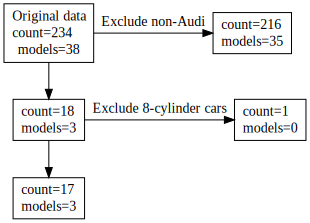

<!-- README.md is generated from README.Rmd. Please edit that file -->

```{r, include = FALSE}
knitr::opts_chunk$set(
  collapse = TRUE,
  comment = "#>",
  fig.path = "man/figures/README-",
  out.width = "100%"
)
```

# exclude

<!-- badges: start -->
<!-- badges: end -->

The goal of exclude is to keep track of excluded dataframe rows.

## Installation

You can install the development version of exclude like so:

``` r
devtools::install_github("FRCBS/exclude")
```

## Examples

This is a basic example which shows you how to solve a common problem:

```{r example}
library(exclude)
library(tidyverse)
```

What is special about using `README.Rmd` instead of just `README.md`? You can include R chunks like so:

```{r Example 1}
## basic example code
mpg %>% 
  init_exclude() %>%
  filter(manufacturer == "audi") %>%
  exclude()
e <- get_exclude()
e
```

You'll still need to render `README.Rmd` regularly, to keep `README.md` up-to-date. `devtools::build_readme()` is handy for this.

```{r}
as_tibble(e)
```

You can also plot the object with `plot(e)`, for example:

```{r, eval=FALSE}
#tibble::as_tibble(e) %>% plot_flow()
plot(e)
```

```{r, echo=FALSE}
library(DiagrammeRsvg)
p <- plot(e)
cat(export_svg(p), file = "man/figures/plot.svg")
```


```{r Example 2}
## basic example code
statistics <- function(df) { list(count = nrow(df), models=n_distinct(df$model)) }
mpg %>% 
  init_exclude(statistics = statistics) %>%
  filter(manufacturer == "audi") %>%
  exclude("Exclude non-Audi") %>%
  filter(cyl < 8) %>%
  exclude("Exclude 8-cylinder cars")
e2 <- get_exclude()
e2
```

```{r, eval=FALSE}
plot(e2)
```

```{r, echo=FALSE}
cat(export_svg(plot(e2)), file = "man/figures/plot2.svg")
```



https://quarto.org/docs/authoring/diagrams.html

```{dot}
digraph graphname {
node [shape="box"];
labeljust = l
             P1 [label = "Original data\lcount=234"]
P2 [label = "count=18"]
             M1 [label = "count=0"]
             P1 -> P2
             P1 -> M1[label="Exclusion"]
             { rank=same; P1; M1}
}
```

In that case, don't forget to commit and push the resulting figure files, so they display on GitHub and CRAN.
