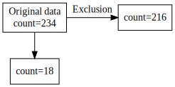
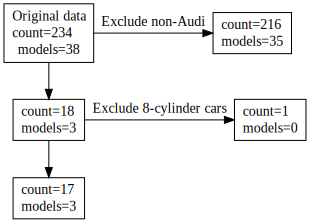
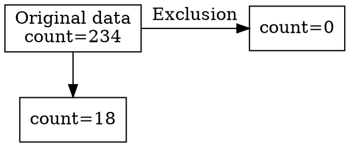

<!-- README.md is generated from README.Rmd. Please edit that file -->

# exclude

<!-- badges: start -->
<!-- badges: end -->

The goal of exclude is to keep track of excluded dataframe rows.

## Installation

You can install the development version of exclude like so:

``` r
devtools::install_github("FRCBS/exclude")
```

## Examples

This is a basic example which shows you how to solve a common problem:

``` r
library(exclude)
library(tidyverse)
#> ── Attaching core tidyverse packages ──────────────────────── tidyverse 2.0.0 ──
#> ✔ dplyr     1.1.4     ✔ readr     2.1.5
#> ✔ forcats   1.0.0     ✔ stringr   1.5.1
#> ✔ ggplot2   3.4.4     ✔ tibble    3.2.1
#> ✔ lubridate 1.9.3     ✔ tidyr     1.3.1
#> ✔ purrr     1.0.2     
#> ── Conflicts ────────────────────────────────────────── tidyverse_conflicts() ──
#> ✖ dplyr::filter() masks stats::filter()
#> ✖ dplyr::lag()    masks stats::lag()
#> ℹ Use the conflicted package (<http://conflicted.r-lib.org/>) to force all conflicts to become errors
```

What is special about using `README.Rmd` instead of just `README.md`?
You can include R chunks like so:

``` r
## basic example code
mpg %>% 
  init_exclude() %>%
  filter(manufacturer == "audi") %>%
  exclude()
#> Exclusion: excluded count=216, remaining count=18
#> # A tibble: 18 × 11
#>    manufacturer model      displ  year   cyl trans drv     cty   hwy fl    class
#>    <chr>        <chr>      <dbl> <int> <int> <chr> <chr> <int> <int> <chr> <chr>
#>  1 audi         a4           1.8  1999     4 auto… f        18    29 p     comp…
#>  2 audi         a4           1.8  1999     4 manu… f        21    29 p     comp…
#>  3 audi         a4           2    2008     4 manu… f        20    31 p     comp…
#>  4 audi         a4           2    2008     4 auto… f        21    30 p     comp…
#>  5 audi         a4           2.8  1999     6 auto… f        16    26 p     comp…
#>  6 audi         a4           2.8  1999     6 manu… f        18    26 p     comp…
#>  7 audi         a4           3.1  2008     6 auto… f        18    27 p     comp…
#>  8 audi         a4 quattro   1.8  1999     4 manu… 4        18    26 p     comp…
#>  9 audi         a4 quattro   1.8  1999     4 auto… 4        16    25 p     comp…
#> 10 audi         a4 quattro   2    2008     4 manu… 4        20    28 p     comp…
#> 11 audi         a4 quattro   2    2008     4 auto… 4        19    27 p     comp…
#> 12 audi         a4 quattro   2.8  1999     6 auto… 4        15    25 p     comp…
#> 13 audi         a4 quattro   2.8  1999     6 manu… 4        17    25 p     comp…
#> 14 audi         a4 quattro   3.1  2008     6 auto… 4        17    25 p     comp…
#> 15 audi         a4 quattro   3.1  2008     6 manu… 4        15    25 p     comp…
#> 16 audi         a6 quattro   2.8  1999     6 auto… 4        15    24 p     mids…
#> 17 audi         a6 quattro   3.1  2008     6 auto… 4        17    25 p     mids…
#> 18 audi         a6 quattro   4.2  2008     8 auto… 4        16    23 p     mids…
e <- get_exclude()
e
#> Original data: excluded count=0, remaining count=234
#> Exclusion: excluded count=216, remaining count=18
```

You’ll still need to render `README.Rmd` regularly, to keep `README.md`
up-to-date. `devtools::build_readme()` is handy for this.

``` r
as_tibble(e)
#> # A tibble: 2 × 3
#>   name          count diff_count
#>   <chr>         <int>      <int>
#> 1 Original data   234         NA
#> 2 Exclusion        18        216
```

You can also plot the object with `plot(e)`, for example:

``` r
#tibble::as_tibble(e) %>% plot_flow()
plot(e)
```

<figure>

<figcaption aria-hidden="true">alt text</figcaption>
</figure>

``` r
## basic example code
statistics <- function(df) { list(count = nrow(df), models=n_distinct(df$model)) }
mpg %>% 
  init_exclude(statistics = statistics) %>%
  filter(manufacturer == "audi") %>%
  exclude("Exclude non-Audi") %>%
  filter(cyl < 8) %>%
  exclude("Exclude 8-cylinder cars")
#> Exclude non-Audi: excluded count=216 models=35, remaining count=18 models=3
#> Exclude 8-cylinder cars: excluded count=1 models=0, remaining count=17 models=3
#> # A tibble: 17 × 11
#>    manufacturer model      displ  year   cyl trans drv     cty   hwy fl    class
#>    <chr>        <chr>      <dbl> <int> <int> <chr> <chr> <int> <int> <chr> <chr>
#>  1 audi         a4           1.8  1999     4 auto… f        18    29 p     comp…
#>  2 audi         a4           1.8  1999     4 manu… f        21    29 p     comp…
#>  3 audi         a4           2    2008     4 manu… f        20    31 p     comp…
#>  4 audi         a4           2    2008     4 auto… f        21    30 p     comp…
#>  5 audi         a4           2.8  1999     6 auto… f        16    26 p     comp…
#>  6 audi         a4           2.8  1999     6 manu… f        18    26 p     comp…
#>  7 audi         a4           3.1  2008     6 auto… f        18    27 p     comp…
#>  8 audi         a4 quattro   1.8  1999     4 manu… 4        18    26 p     comp…
#>  9 audi         a4 quattro   1.8  1999     4 auto… 4        16    25 p     comp…
#> 10 audi         a4 quattro   2    2008     4 manu… 4        20    28 p     comp…
#> 11 audi         a4 quattro   2    2008     4 auto… 4        19    27 p     comp…
#> 12 audi         a4 quattro   2.8  1999     6 auto… 4        15    25 p     comp…
#> 13 audi         a4 quattro   2.8  1999     6 manu… 4        17    25 p     comp…
#> 14 audi         a4 quattro   3.1  2008     6 auto… 4        17    25 p     comp…
#> 15 audi         a4 quattro   3.1  2008     6 manu… 4        15    25 p     comp…
#> 16 audi         a6 quattro   2.8  1999     6 auto… 4        15    24 p     mids…
#> 17 audi         a6 quattro   3.1  2008     6 auto… 4        17    25 p     mids…
e2 <- get_exclude()
e2
#> Original data: excluded count=0 models=0, remaining count=234 models=38
#> Exclude non-Audi: excluded count=216 models=35, remaining count=18 models=3
#> Exclude 8-cylinder cars: excluded count=1 models=0, remaining count=17 models=3
```

``` r
plot(e2)
```

<figure>

<figcaption aria-hidden="true">alt text</figcaption>
</figure>

<https://quarto.org/docs/authoring/diagrams.html>




In that case, don’t forget to commit and push the resulting figure
files, so they display on GitHub and CRAN.
